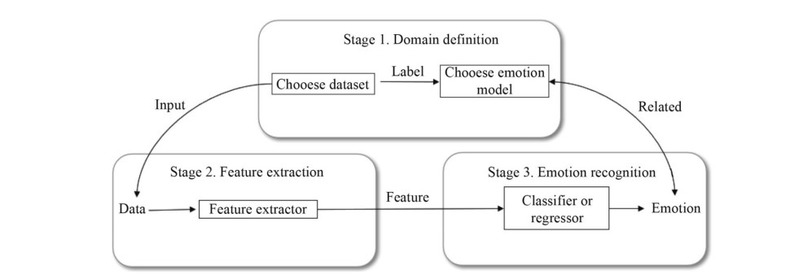
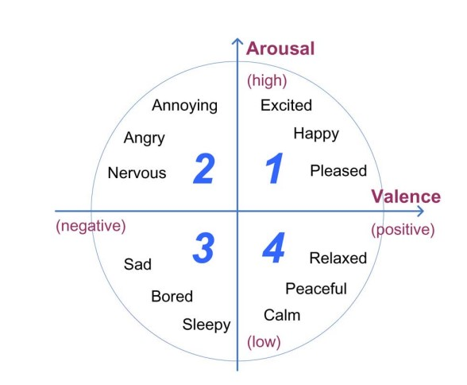
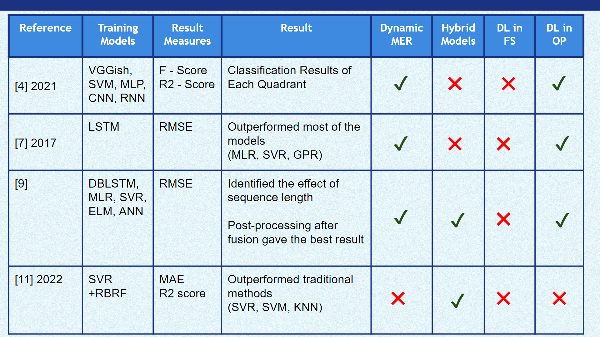
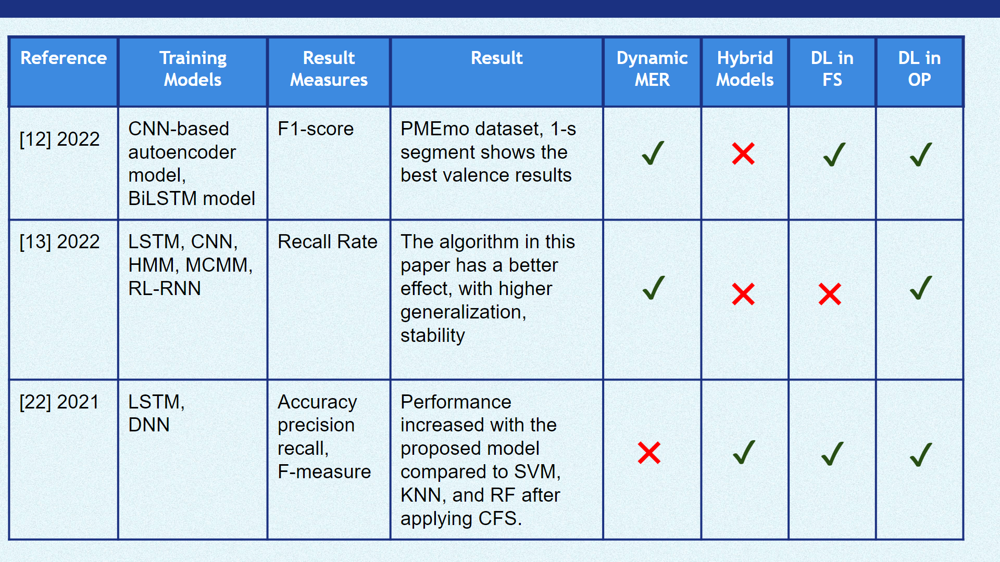
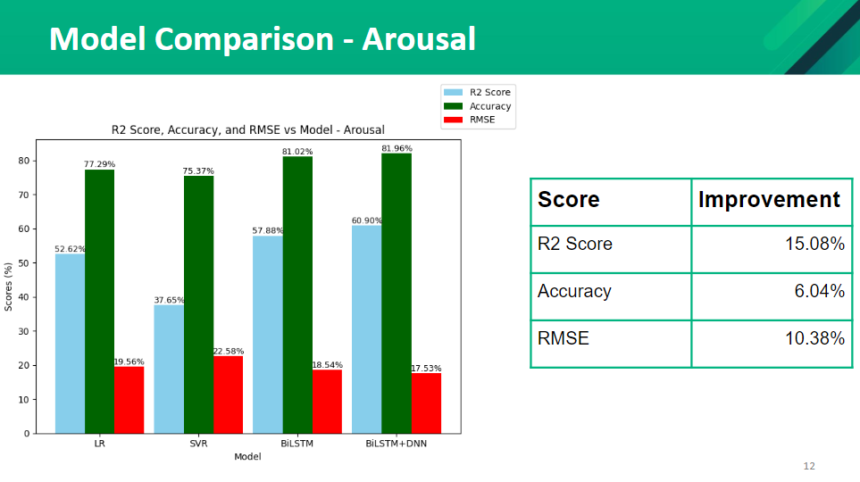
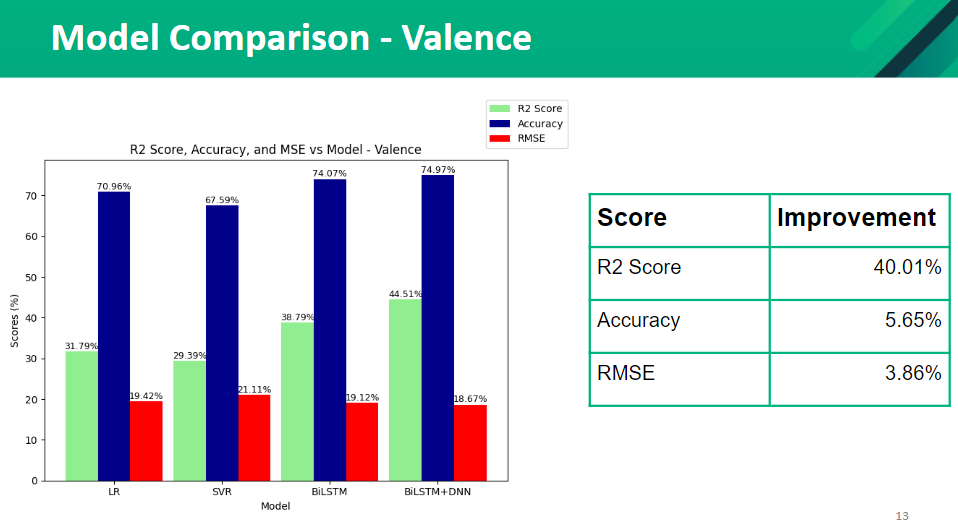

[comment]: # "This is the standard layout for the project, but you can clean this and use your own template"

# Music Emotion Recognition

#### Team

- E/17/040, Chandrasena M.M.D, [email](e17040@eng.pdn.ac.lk)
- E/17/356, Upekha H.P.S , [email](e17356@eng.pdn.ac.lk)
- E/17/407,  Wijesooriya H.D, [email](mailto:e17407@eng.pdn.ac.lk)

#### Supervisors

- Prof. Roshan Ragel, [email](roshanr@eng.pdn.ac.lk)
- Dhanushki Mapitigama, [email](dhanumapitigama@eng.pdn.ac.lk)

#### Table of content

1. [Abstract](#abstract)
2. [Related works](#related-works)
3. [Methodology](#methodology)
4. [Experiment Setup and Implementation](#experiment-setup-and-implementation)
5. [Results and Analysis](#results-and-analysis)
6. [Conclusion](#conclusion)
7. [Publications](#publications)
8. [Links](#links)

## Abstract
Music is a powerful language that stirs up a wide range of emotions in people. Understanding and recognizing these emotions is crucial for applications like personalized music recommendations, music therapy, and affective computing. Music Emotion Recognition (MER) systems aim to automatically analyze and classify the emotional content of music, providing insights into how different compositions affect our emotions. 

#### Preliminary Knowledge
Existing MER publications can be mainly categorized into two sections, namely song-level MER (or static) and music emotion variation detection (MEVD, or dynamic). Assigning
the overall emotion label (or labels, if the task is viewed as a multi-classification or regression problem) to one song is referred to as song-level MER.MEVD considers the emotion of the music as a changing process, where the dynamic changing process of emotion needs to be recognized when conducting MEVD research.

#### Research framework: 
Most existing MER works based on machine learning include three parts and they are, domain definition, feature extraction, and emotion recognition. “Figure. 1”, shows the overall framework of MER systems.

#### Emotion Model: 
Dimensional emotion models are widely used in MER systems. There are two main dimension emotion models namely Thayer’s emotion model and Russell’s circumplex model. Both models use arousal and valence values (AV values) to identify the emotion in a given music sample. Associated with the AV values, each music sample becomes a point in the arousal-valence plane, so the users can efficiently retrieve the music sample by specifying a desired point in the emotion plane."Figure. 2" shows Thayer’s emotion model associated with MER.

| Figure 1 | Figure 2 |
| ------- | ------- |
|  |  |
|  MER framework   |  Thayer’s arousal-valence emotion plan |

## Related works
In the research study <b>[7] </b>, "Multi-scale Context Based Attention for Dynamic Music Emotion Prediction" by Ye Ma, XinXing Li, Mingxing Xu, Jia Jia, and, Lianhong Cai, developed a system to recognize the continuous emotion information in music. A two-dimensional valence-arousal emotion model was used to represent the dynamic emotion music. The proposed method was evaluated using the MediaEval 2015 dataset. They proposed Long Short-Term Memory (LSTM) based sequence-to-one mapping for dynamic music emotion prediction. Based on this sequence-to-one music emotion mapping, it is proved that different time scales’ preceding content has an influence on the LSTM model’s performance, so we further propose the Multi-scale Context based Attention (MCA) for dynamic music emotion prediction. In this research, they proposed a Multi-scale Context based Attention (MCA) model for dynamic music emotion prediction, of which the scale is a new use of attention mechanism: to give different time scales’ preceding context respective attention weights. As mentioned above, the music emotion at a specific time is the accumulation of a piece of music content before that time point. As we cannot verify how much previous content is suitable for the emotion prediction, they paid different attention to the previous context of different time scales, where the weights of different scales are dynamically computed by the model.

In the research <b> [9] </b>, "DBLSTM-Based Multi-Scale Fusion for Dynamic Emotion Prediction in Music" by Xinxing Li, Jiashen Tian, Mingxing Xu, Yishuang Ning, and Lianhong Cai, proposed a regression-based method to predict the music's emotion. The emotion model proposed by Russel was used to identify the emotion in the 2D plane. As music emotion is not only associated with the previous content but also with the future one, Bidirectional Long Short-Term Memory (BLSTM) is considered a better choice because of its ability to use both previous and future information. The regression methods for dynamic music emotion can be classified into two categories. In one category it maps a single feature vector to the V-A values, this is what the traditional regression methods (e.g. MLR and SVR) do on the basis of the information in individual frames. In the other category, it maps a feature sequence to the sequence of V-A values, the models accomplish this by taking the context information into account, such as LSTM and BLSTM. LSTM, a redesign of the recurrent neural networks (RNNs), is good at exploiting and storing information for long periods of time. BLSTM, developed based on LSTM, can not only exploit context for long periods of time but also access the context in both previous and future directions. For the dynamic music emotion prediction problem, it is more meaningful to exploit information in both directions. Inspired from deep feed-forward network, they stack multiple recurrent hidden layers on top of each other to get a better representation of data, obtaining the DBLSTM model.

The paper "Study on Music Emotion Recognition Based on the Machine Learning Model Clustering Algorithm”, by Yu Xia and Fumei Xu<b> [11] </b>, implemented a regression-based music emotion classification system.The dataset used in this study was in the MediaEval database.In the training part, three algorithms, namely, polynomial regression, support vector regression, and k-plane piecewise regression, were used to obtain the regression model. In the test part, the input music data was regressed and predicted to obtain its VA value and then classified, and the system performance was considered by classification accuracy. Results show that the combined method of support vector regression and k-plane piecewise regression improves the accuracy by 3 to 4 percentage points compared to using one algorithm alone; compared with the traditional classification method based on a support vector machine, the accuracy improves by 6 percent points. In this study, the mean absolute error (MAE), the regression value accuracy (Ac), and the sentiment classification accuracy (Ac of classification) were used as the evaluation criteria for the music sentiment classification system based on three different regression methods.

| Table 1 | Table 2 |
| ------- | ------- |
|  |   |

## Methodology

## Experiment Setup and Implementation

## Results and Analysis

### Baseline Model VS Proposed Model
Initially, we tried different models and compared the accuracy with our model. We tried linear regression, SVR, BiLSTM, and BiLSTM+DNN. Our baseline model is a linear regression model. The performance of each model was measured using 5-fold cross-validation. The parameters used in the BiLSTM model are Folds = 5, Learning Rate=0.001, Epochs=25, Batch Size=32, Optimizer = Adam, Activation Function=relu. Initially, we had a single layer in DNN and it has 512 units. Later in the research we increased the number of layers in DNN and tested the accuracies. The following figures show the comparison of our model (BiLSTM + DNN ) with other models.
| Arousal | Valence |
| ------- | ------- |
|  |   |

### Feature Selection
  We tried different feature selection methods such as PCA and CFS (co-relation-based feature selection). After applying those two methods to our model we found that the model with PCA has the highest accuracy compared to the model with the CFS features. We were able to improve our initial model's performance by applying the PCA feature selection method. The  accuracies are as follows.

### Parameter Tuning

### Application of DNN

### Existing Models VS Best Model Developed

## Conclusion

## Publications
[//]: # "Note: Uncomment each once you uploaded the files to the repository"

<!-- 1. [Semester 7 report](./) -->
<!-- 2. [Semester 7 slides](./) -->
<!-- 3. [Semester 8 report](./) -->
<!-- 4. [Semester 8 slides](./) -->
<!-- 5. Author 1, Author 2 and Author 3 "Research paper title" (2021). [PDF](./). -->

## Links

[//]: # ( NOTE: EDIT THIS LINKS WITH YOUR REPO DETAILS )

- [Project Repository](https://github.com/cepdnaclk/e17-4yp-Music-Emotion-Recognition)
- [Project Page](https://cepdnaclk.github.io/e17-4yp-Music-Emotion-Recognition/ )
- [Department of Computer Engineering](http://www.ce.pdn.ac.lk/)
- [University of Peradeniya](https://eng.pdn.ac.lk/)

[//]: # "Please refer this to learn more about Markdown syntax"
[//]: # "https://github.com/adam-p/markdown-here/wiki/Markdown-Cheatsheet"
